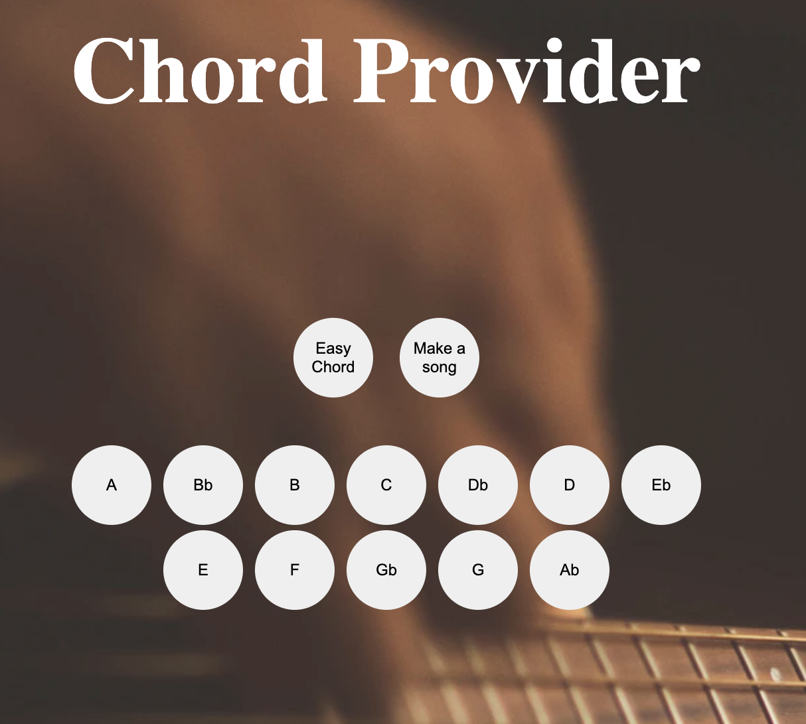
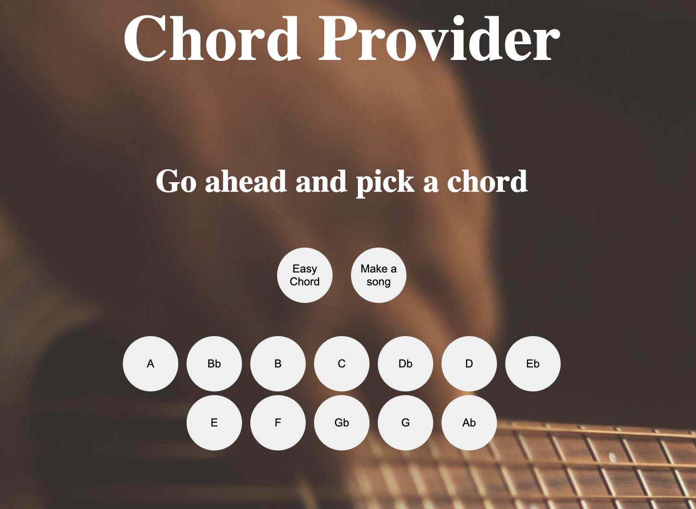
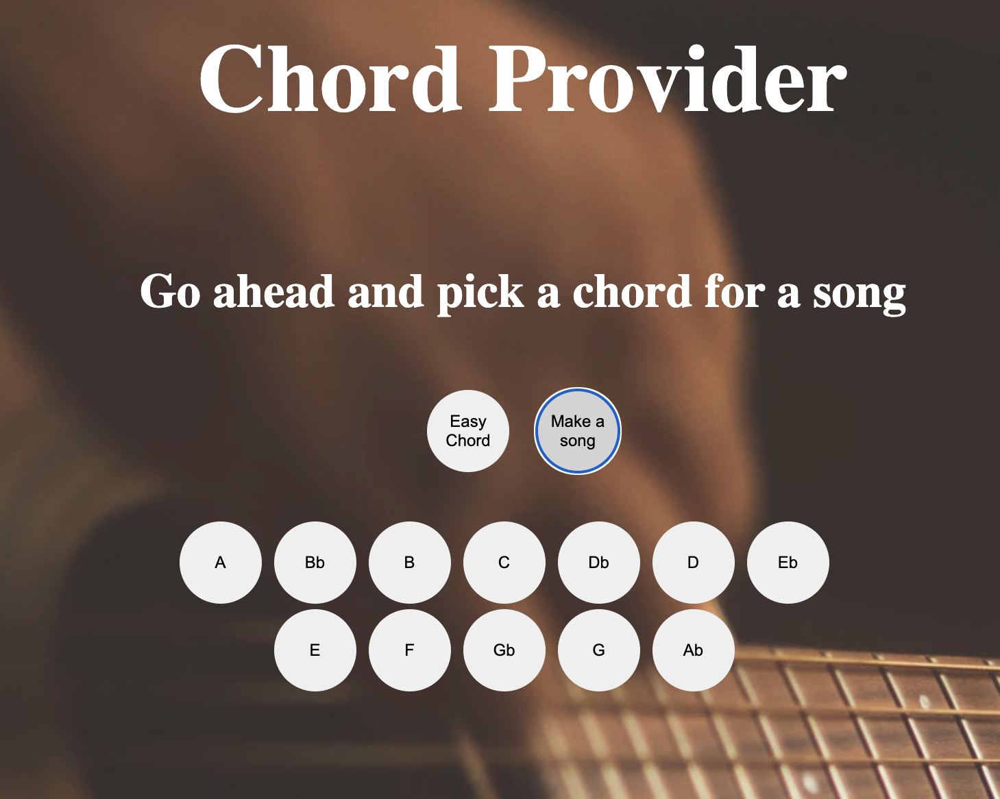
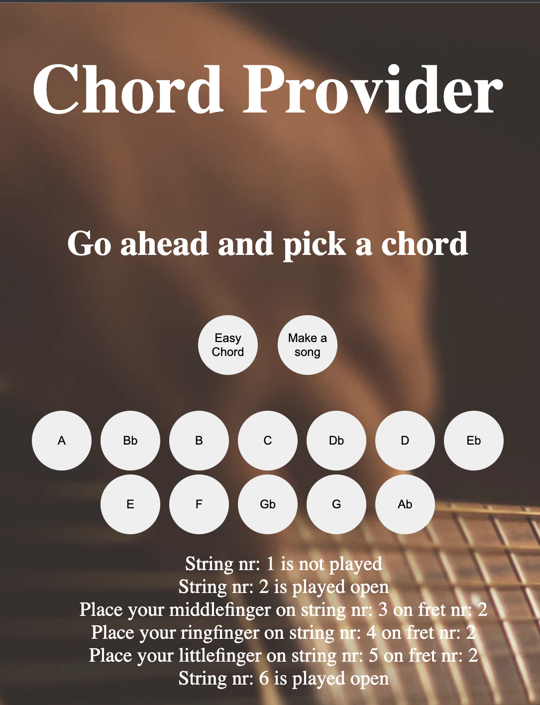
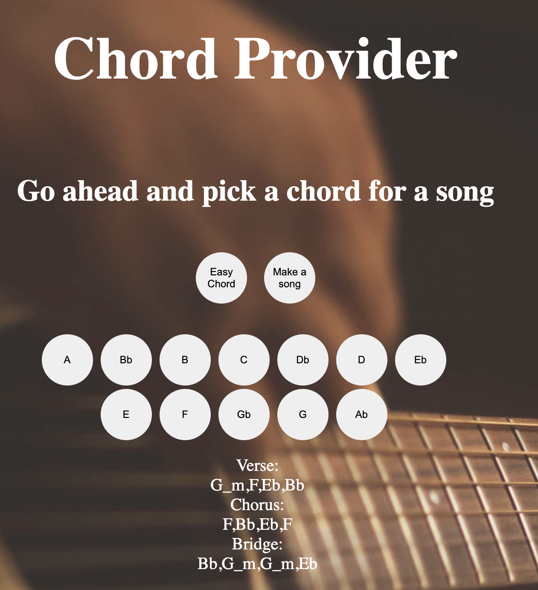
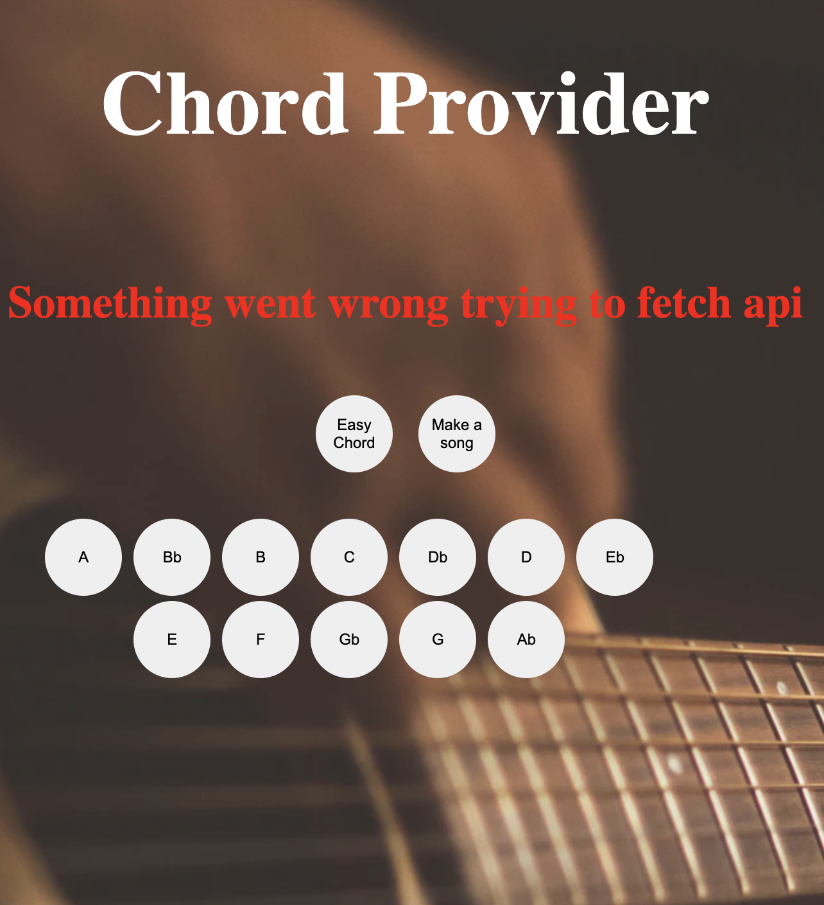

# Vision
Denna applikation är tänkt att bli en web-app som erbjuder en slutanvändare att lära sig spela gitrarr på ett enkelt sätt. Tanken är att kunna presentera instruktionerna så att användaren inte behöver ha särskillt stor kunskap om hur ackord vanligtvis presenteras utan som en enkel beskrivning i ord hur man går tillväga. Ofta görs detta på ett sätt där du behöver kunskap om hur ackord vanligtvis noteras. Detta gör att appen till stor del riktar sig till nybörjare. Användaren ska också ha möjlighet att välja att skapa en sångstruktur utifrån ett ackord och sedan få ackord som passar i tonarten serverade.

# Icke Funktionella krav
- Applikationen ska vara skriven i javascript.
- Applikationen ska kännas robust och användarvänlig.
- Applikationen ska följa lnu´s linting kodstandard.

# Funktionella Krav
- En slutanvändare ska kunna välja ett av två alternativ. Antingen att få ett ackord enkelt presenterat som en text alternativt få en sångstruktur baserad på valt ackord.
- En slutanvändare ska kunna välja ett ackord utav de tolv dur-ackord som existerar. Detta ska göras via knappar.
- Om vi inte kan göra fetchen till api så ska ett meddelande om detta visas för användaren användaren.

# Testning
För att testa applikationen så har jag använt mig av manuella enhetstester i form av Use cases.

# Testrapport

| User cases| Testmetod | Status|       
| --------- |:---------:|:-----:|
| UC 1      | Manuellt test   |✅ |
| UC 2.1    | Manuellt test   |✅ |
| UC 2.2    | Manuellt test   |✅ |
| UC 3      | Manuellt test   |✅ |
| UC 4      | Manuellt test   |✅ |
| UC 5      | Manuellt test   |✅ |

---

## Förberedelser
* Installera applikationen enligt instruktionerna i README.md

---

# Testfall

## UC1 Navigera till startsidan 

**Beskrivning:** Testet utförs i syfte att kontrollera om användaren kommer till applikationens startsida.

**Instruktioner**
1. Starta genom att skriva följande kommando i terminalen `npm run dev`.
2. Fälj den länk som presenteras till local host.

**Förväntat utfall:** 

 

---

## UC2.1 – Välj alternativet Easy Chord

**Beskrivning:** Testet utförs i syfte att kontrollera om användaren kan välja Easy Chord.

**Instruktioner**
1. Välj alternativet Easy Chord genom att trycka på knappen.

**Förväntat utfall:** 

 

---

## UC2.2 – Välj alternativet Make a song

**Beskrivning:** Testet utförs i syfte att kontrollera om användaren kan välja Make a song.

**Instruktioner**
1. Välj alternativet Make a song genom att trycka på knappen.

**Förväntat utfall:** 

 

---

## UC3 – Välj ackordet A att presentera som Easy Chord

**Beskrivning:** Kontrollerar att applikationen visar ett ackord presenterat som instruktioner i text.

**Instruktioner**
1. Välj alternativet Easy Chord genom att trycka på knappen.
2. Tryck på knappen A

**Förväntat utfall:** 

 

---

## UC4 – Välj ackordet Bb att presentera som Make a song

**Beskrivning:** Kontrollerar att applikationen visar en sångstruktur baserad på ackordet Bb.

**Instruktioner**
1. Välj alternativet Make a song genom att trycka på knappen.
2. Tryck på knappen Bb

**Förväntat utfall:** 
Eftersom denna metod returnerar en slumpvis utvald ackordstruktur med ackord i rätt tonart så kommer olika ackord att finnas i strukturen.
Bilden visar ett exempel på detta.
Tester för att se att rätt ackord väljs ut finns i de automatiska testerna i Laboration-1

 

---
## UC5 – Flashmeddelande om användaren saknar uppkoppling eller om något gick fel när appen försökte hämta info från API.

**Beskrivning:** Kontrollerar att applikationen visar ett flashmeddelande om något gick fel gällande uppkoppling eller fetch.

**Instruktioner**
1. Stäng av Wi-Fi.
2. Välj alternativet Make a song genom att trycka på knappen.
3. Tryck på knappen A

**Förväntat utfall:** 

 

---

