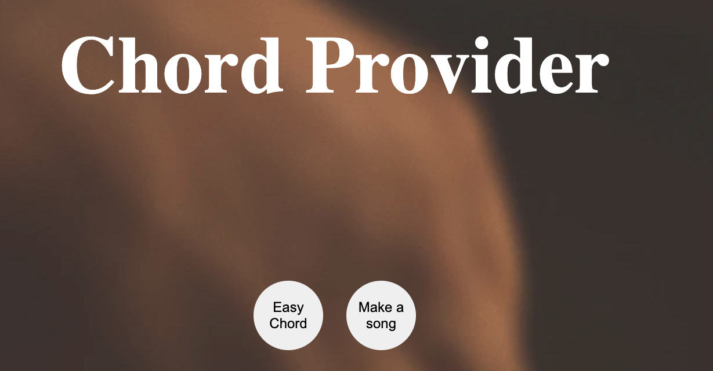
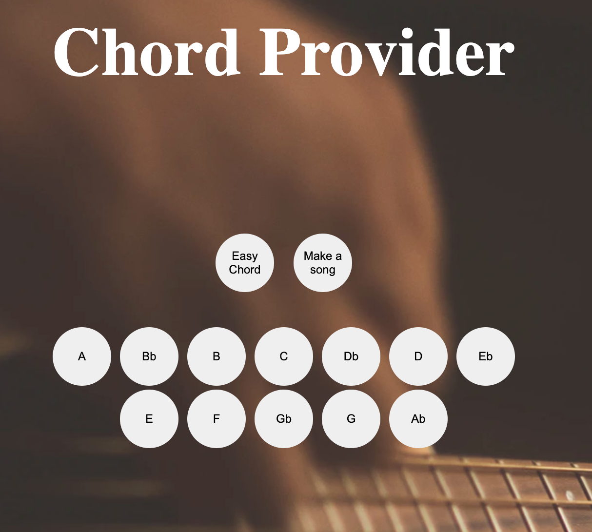

# **Chord Provider**
This application serves the possibility to get guitarchords presented in an easy way and the possibility to get a random song based on a specific chord.


It is primarily aimed at beginners in playing the guitar.

It uses the https://api.uberchord.com/ API. Please check documentation for further info

## Specific music terms:
<ul>
  <li>Chord: Ackord(sammansättning av flera toner)</li>
  <li>Key: Tonart(Tonart, en uppsättning toner (skala) där en av tonerna har rollen som grundton.)</li>
  <li>String: gitarrsträng</li>
  <li>Fret: Greppband(metallband längs greppbrädet på gitarren)</li>
   <li>Transpose: Transponera(Transponering av musik innebär att man flyttar en fras, del av stycke eller hela verk uppåt eller nedåt i tonhöjd så att de inbördes intervallen inte ändras men hela området byter tonart.)</li>
   <li>Verse: Vers i en sångstruktur</li>
   <li>Chorus: Refräng i en låtstruktur</li>
   <li>Bridge: Brygga i en låtstruktur(brygga inom populärmusik avser oftast den del som kan komma mellan en kompositions verser och refränger) </li>
</ul>


## **Installation**
---
Pleaso follow this link and clone repo [Link to Repo](https://github.com/guskar/Laboration-2.git)

 ```
 git clone https://github.com/guskar/Laboration-2.git
 ```

Then type following in terminal

```
npm install
```

## Dependencies

```
"devDependencies": {
    "@lnu/eslint-config": "^1.1.4",
    "vite": "^2.6.7"
  }
```

## **Usage**
---
Start the application by typing the following in terminal for setting up a local host.

```
npm run dev
```

When starting the application you get the following options.

The two buttons represents the two options. You can either choose to get at chord presented in text or get a random song structure based on the chord you choose.

 


There are several buttons representing the chords to choose from. After choosing one of the options above you can go ahead and press one of the chords to get a chord as text or a random song based on the chords.



## Contributing

Please feel free to open an issue on Github if you would like to make any major changes to the applications's source code. 

## 1dv610-mjukvarukvalitet-L2

