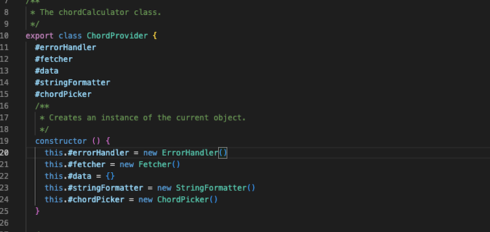
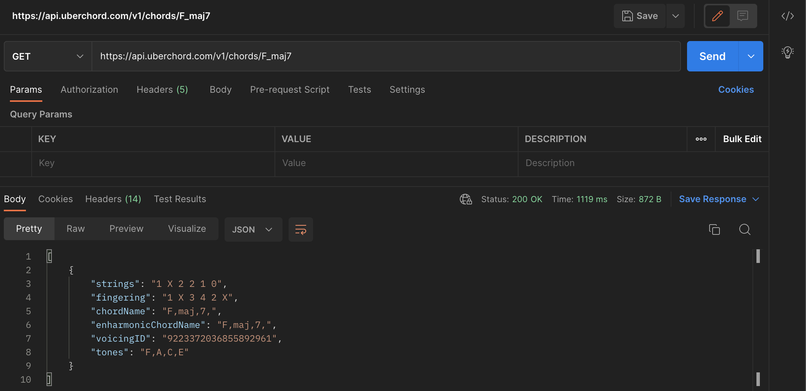
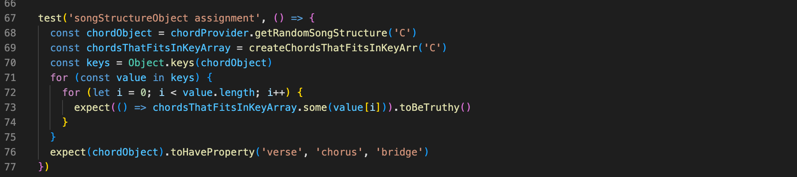
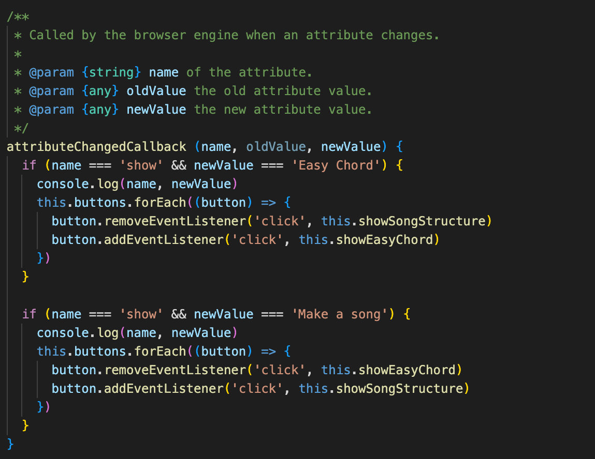

# Reflektioner

# Meaningful names
Genom hela skapandet av både min modul och denna app så har det här känts som en av de viktigaste frågorna. Genomgående har jag försökt använda mig av det som i boken omnämns som **intention revealing names**. Alltså att vi, på alla klasser metoder eller variabler, ska sträva efter namngivning som svarar på frågor som varför de ens finns, vad dom gör och hur de används. På så sätt kan vi i förlängningen göra oss av med onödiga kommentarer som bara blir “noise”. Många gånger resulterar det i att mina namn kanske blir något långa och därmed försämrar readability men då också förbättrar understandability. Exempelvis har jag en metod som heter getRandomSongStructure() som kan tyckas något lång men som förklarar tydligt vad metoden gör.

**Avoid disinformation** - En sak jag upptäckte var att ämnesspecifika termer ibland hade en tendens att blandas ihop med termer inom programmeringsvärlden. Ett tydligt exempel på detta var när jag skulle jobba med gitarrens strängar som då, till en början, fick variabelnamnet strings vilket jag snabbt insåg behövde bytas ut till guitarStrings.

 

# Functions 
I bokens kapitel Functions har jag tagit fasta på tre koncept att försöka fokusera på som känns väldigt relaterade till varandra.
**Small** - Denna regel säger enligt boken att funktioner i det flesta fall tjänar på att hållas små(20-30 rader). Detta har verkligen varit en utmaning att följa men det börjar kännas mer naturligt att hitta vägen närmre det resultatet. 
**Do one thing** - Denna regel känns som sagt hårt sammankopplad med senast nämnda. Detta tycker jag att jag lyckats relativt bra med
**One level of abstraction per funktion** - Denna regel tycker jag har varit svår att följa hela vägen. Användandet av webbkomponenter gjorde detta svårt då de ofta skrivs på ett visst sätt.

 
 ---
 

# Comments 
Det här kapitlet har för mig blivit något jag har fått lägga åt sidan en del. På något sätt tycker jag att jag verkligen försökt skriva kod som är självkommenterande **Explain yourself in code**. Spontant känner jag att jag skulle vilja plocka bort större delen av min javadoc då den i många fall blir **Mumbling** och **Noise Comments**. På något sätt upplever jag att vi genom hela utbildningen hittills mest skrivit exempelvis javadoc-kommentarer för att eslint säger åt oss att göra det. Så här finns en hel del att lära sig och förbättra. Däremot ser jag att just i javascript så fyller de en funktion i att de informerar om typer eftersom javascript är ett löst typat språk.

 

# Formatting 
Genom hela utbildningen har jag använt mig av lnu´s extention av eslint som verktyg för att säkerställa att koden håller en bra standard. Det har på så sätt blivit mina **Team Rules**. Här får jag hjälp med att kod, som inte följer det givna mönstret, rödmarkeras. På så sätt kan jag försäkra mig om att kodstandarden följs och löser fler av de koncept som tas upp i kapitlet, exempelvis vad det gäller indentering.
I detta kapitel diskuterar författaren även en grundregel som kallas **The Newspaper metafor** vilken jag försökt följa i mina klasser, genom att de ska vara läsbara uppifrån och ner med instansvariabler samlade högst upp, men som jag tyckt blivit svårare i mappstrukturen när jag blandar in mina webbkomponenter.

 

# Objects and Datastructures 
**The Law of Demeter** är en regel som säger att ett objekt inte ska veta om ett annat objekts innehåll fullt ut. I min klass chordPicker som jag bröt ut i refaktureringen av min modul så finns ett fryst objekt med giltiga ackord som inte någon annan klass behöver veta om eller ska kunna manipulera. Därför väljer jag att anropa klassens publika metoder och låta klassen själv jobba med objektet internt i form att välja ut och returnera värden från objektet.

 

# Error handling 
Större delen av min error hantering ligger i en egen klass vid namn ErrorHandler där felen kastas uppåt och sedan får utvecklaren välja hur den vill hantera felen. Detta gör att övrig kod inte kladdas ner av felhanteringen i lika stor utsträckning. I Clean code kan vi läsa om att vi inte ska returnera null **Don´t return null** utan istället returnera exeptions. I kurserna där vi använt java som programmeringsspråk så har jag i stor utsträckning använt mig av att returnera null men inte alls på samma sätt i javascript. I gränssnittet har jag säkrat upp de flesta av felen som kan uppstå genom att jag bara erbjuder ett visst antal ackord som alternativ. Eftersom jag använder mig av ett api blir det viktigt att hantera ett fel som sker i kommunikationen med detta. Det gör jag med hjälp att ett custom event som skickar upp detta till föräldernoden som sen kan visa detta som ett flashmeddelande för slutanvändaren. I den komponent som använder min modul ligger sen de try catch som omsluter koden som berörs.

 
---
 

# Boundaries 
I min applikation använder jag mig av ett api för att fetcha ackorden. **Exploring and learning boundaries** -  I Clean code diskuteras att det är bra att lära känna tredjepartskod genom learning tests. I mitt fall startade jag hela mitt projekt genom att läsa dokumentationen kring detta api samt utföra dessa tester direkt via postman. På detta sätt fick jag en tydlig bild av hur det fungerar, vilket kändes viktigt då hela modulens grund baseras på detta. Min egen modul som i sin tur skulle kunna bli tredjepartskod för en annan utvecklare testas även på liknande sätt i dess exempelapp.

 

# Unit tests 
När det kommer till testningen av min modul så beslutade jag mig för att göra end-to-end tester i ramverket Jest. Detta är något jag inte alls känner mig hemma i varför jag fick ta med i beräkningen att det kunde ta lite tid.

**One Assert Per Test** - Denna regel tycker jag att jag har kunnat hålla mig till mkt på grund av att mina tester inte är så komplicerade och relativt små.

**Single Concept Per Test** - Denna regel kunde jag följa nästan genomgående utom i ett test där jag behövde anropa två olika metoder samt ha logik i testet, vilket gjorde detta lite rörigare. (Se bild nedan)

 

# Classes 
I refaktureringen av min modul så blev det tydligt, att de metoder som exporterades i helperFunctions.js, egentligen borde tillhöra olika koncept och brytas ut i olika klasser. Exempelvis fanns där några metoder som använde sig av ett fryst enum-object med alla tillgängliga ackord och sedan fanns några som ansvarade använde sig av ett enum för strängformatering. Därför bröt jag ut dessa i en chordPicker klass och en formatter klass. Detta för att uppnå högre sammanhållning(Cohesion) mellan dem. På detta sätt känns min kod också mer objektorienterad. Jag kan då också börja sträva mot att klasser blir minde och i slutändan kanske jag även uppnår att de bara har ett ansvarsområde och en anledning att ändras.

 
---
 

# Systems 
Vad det gäller hela uppbyggnaden av min app så känner jag att det är en av de största utmaningarna jag har framför mig. Jag känner att jag börjar förstå koncepten i sin helhet, exempelvis i dina exempel från föreläsningarna, men tycker att det är svårt att implementera det i min egen kod när projekten växer. En grundregel som jag tagit fasta på är **Separation of concerns** - som jag arbetat med genomgående. I vissa lägen tycker jag att den är svår att följa, kanske framförallt gällande mina webbkomponenter, men på det stora hela tycker jag att mina klasser och metoder är relativt små och gör, om inte en sak, så i alla fall inte alltför många saker.

Gällande mina webbkomponenter så har jag gjort i alla fall två av dessa både återanvändbara och anpassade för att skala upp appen via attribut. Exempelvis har min display komponent ett attribut som anger vilken typ av info som den ska visa. Vilket gör att jag kan bygga på med mer funktionalitet framöver. (Se bilden nedan)

 

 # Summering

 Något som jag tyvärr inte tog med i beräkningen i skapandet av min app var tiden det skulle ta att sätta sig in i användandet av Vanilla.js webbkomponenter. Detta gjorde att jag fastnade en hel del i implementeringen av gränssnittet, varför jag känner att detta hade kunnat byggas ut mer. Fokuset hamnade därför mkt på att refakturera kod i min modul vilket jag tycker att jag lyckats bra med. Det gav också tillfälle att verkligen reflektera över det jag läst i kurslitteraturen och försöka applicera detta i refaktureringen. I stort blev det också tydligt att det blev svårare att applicera samma tänk gällande webbkomponenter som vi lärt oss skriva på ett visst sätt. 
