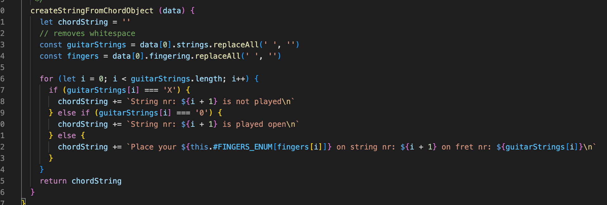
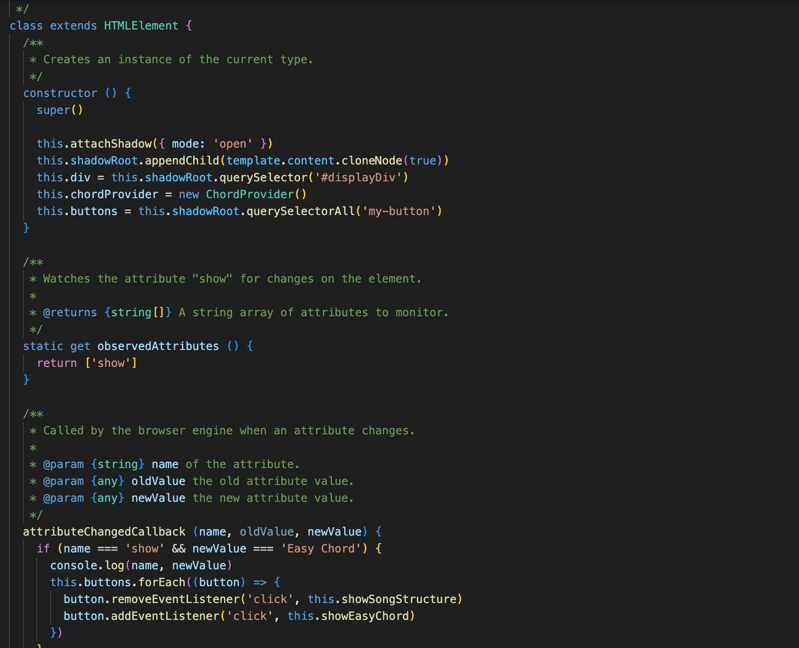
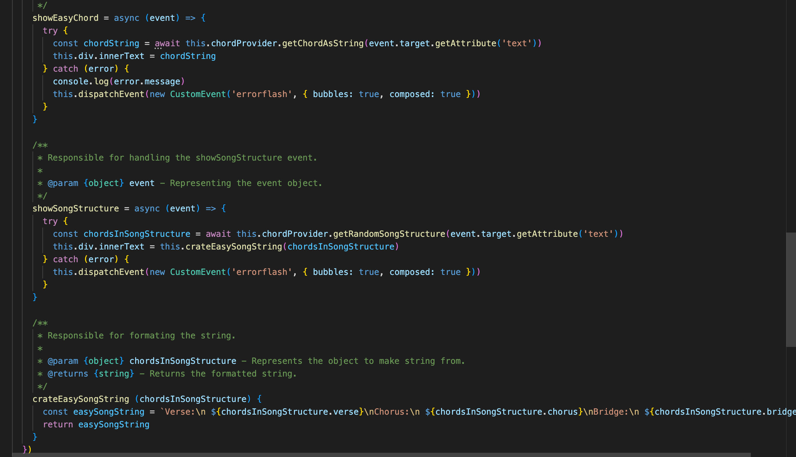
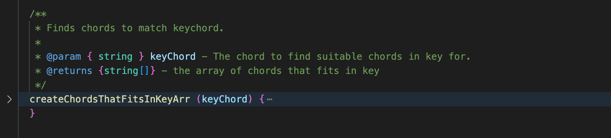
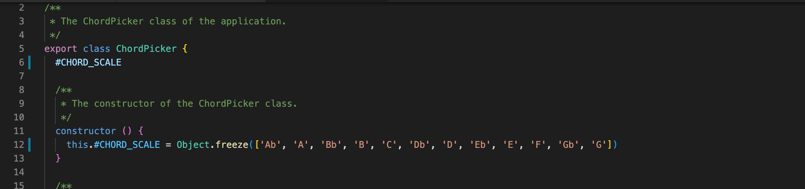
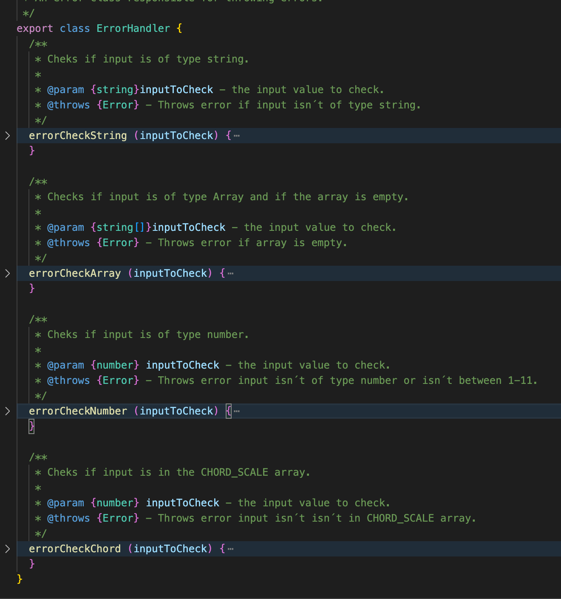
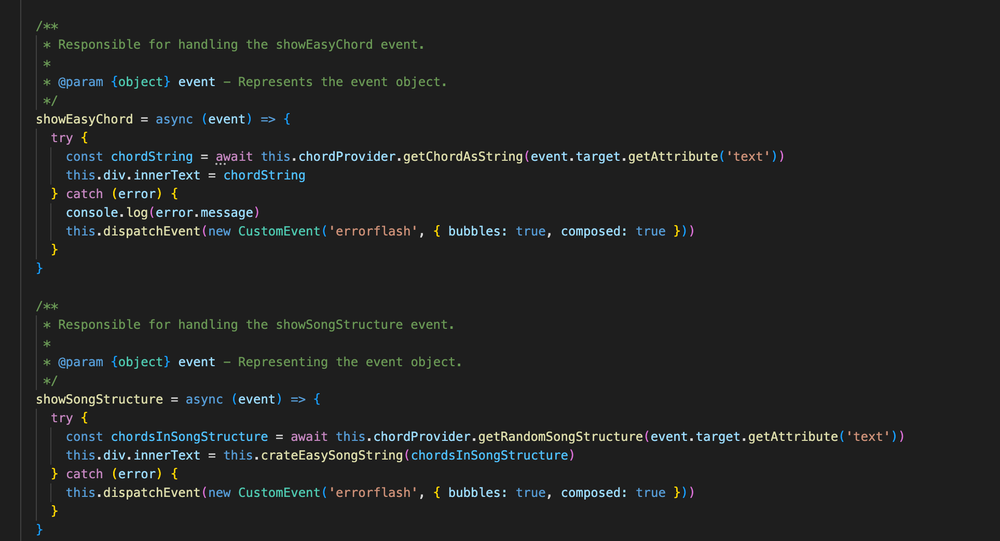
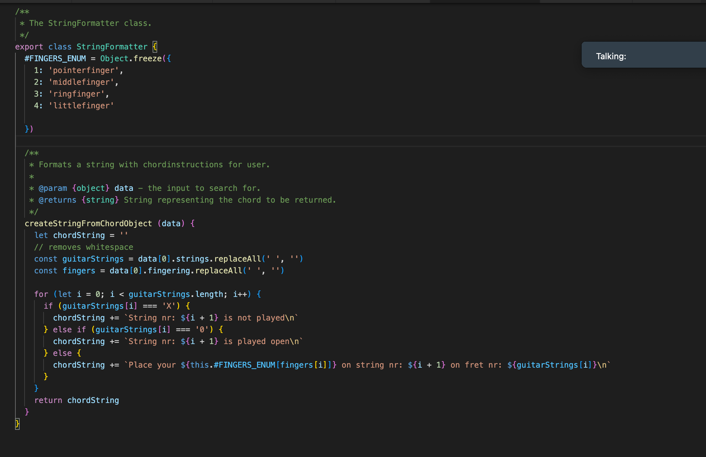
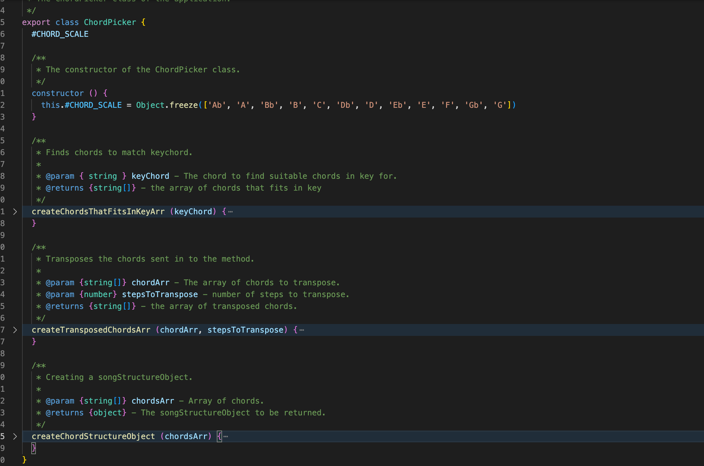

# Reflektioner

### Meaningful names
Genom hela skapandet av både min modul och denna app så har det här känts som en av de viktigaste frågorna. Genomgående har jag försökt använda mig av det som i boken omnämns som intention revealing names. Alltså att vi, på alla klasser metoder eller variabler, ska sträva efter namngivning som svarar på frågor som varför de ens finns, vad dom gör och hur de används. På så sätt kan vi i förlängningen göra oss av med onödiga kommentarer som bara blir “noise”. Många gånger resulterar det i att mina namn kanske blir något långa och därmed försämrar readability men då också förbättrar understandability. Exempelvis har jag en metod som heter getRandomSongStructure() som kan tyckas något lång men som förklarar tydligt vad metoden gör.

**Avoid disinformation** - En sak jag upptäckte var att ämnesspecifika termer ibland hade en tendens att blandas ihop med termer inom programmeringsvärlden. Ett tydligt exempel på detta var när jag skulle jobba med gitarrens strängar som då, till en början, fick variabelnamnet strings vilket jag snabbt insåg behövde bytas ut till guitarStrings.

 

### Functions 
I bokens kapitel Functions har jag tagit fasta på tre koncept att försöka fokusera på som känns väldigt relaterade till varandra.
**Small** - Denna regel säger enligt boken att funktioner i det flesta fall tjänar på att hållas små(20-30 rader). Detta har verkligen varit en utmaning att följa men börjar kännas mer naturligt att hitta vägen närmre det resultatet. 
**Do one thing** - Denna regel känns som sagt hårt sammankopplad med senast nämnda. Den säger egentligen att vi ska sträva efter att våra funktioner bara ska göra en sak. Här kan jag ibland känna att det är svårt att följa denna till punkt och pricka men jag tycker ändå att jag lyckats bra.
**One level of abstraction per funktion** - Denna regel tycker jag har varit svår att följa hela vägen. Särskilt i min app där jag upplevde det betydligt svårare att jobba med detta i användandet av webbkomponenter. I dessa har jag svårt att veta hur strukturen ska delas upp. Se bild nedan.

 
 

### Comments 
Det här kapitlet har för mig blivit något jag har fått lägga åt sidan en del. På något sätt tycker jag att jag verkligen försökt skriva kod som är självkommenterande(Explain yourself in code). Så spontant känner jag att jag skulle vilja plocka bort större delen av min javadoc då den i många fall blir det som i boken beskrivs som Mumbling och Noise Comments. På något sätt upplever jag att vi genom hela utbildningen hittills mest skrivit  exempelvis javadoc- kommentarer för att eslint säger åt oss att göra det. Så här finns en hel del att lära sig och förbättra. Däremot ser jag att just i javascript så fyller de en funktion i att de informerar om typer eftersom javascript är ett löst typat språk.

 

### Formatting 

### Objects and Datastructures 
**The Law of Demeter** är en regel som säger att ett objekt inte ska veta om ett annat objekts innehåll fullt ut. I min klass chordPicker som jag bröt ut i refaktureringen av min modul så finns ett fryst objekt med giltiga ackord som inte någon annan klass behöver veta om eller ska kunna manipulera. Därför väljer jag att anropa klassens publika metoder och låta klassen själv jobba med objektet internt i form att välja ut och returnera värden från objektet.

 

### Error handling 
Större delen av min error hantering ligger i en egen klass vid namn ErrorHandler där felen kastas uppåt och sedan får utvecklaren välja hur den vill hantera felen. Detta gör att övrig kod inte kladdas ner av felhanteringen i lika stor utsträckning. I Clean code kan vi läsa om att vi inte ska returnera null **Don´t return null** utan istället returnera exeptions. I kurserna där vi använt java som programmeringsspråk så har jag i stor utsträckning använt mig av att returnera null men inte alls på samma sätt i javascript. I gränssnittet har jag säkrat upp de flesta av felen som kan uppstå genom att jag bara erbjuder ett visst antal ackord som alternativ. Eftersom jag använder mig av ett api blir det viktigt att hantera ett fel som sker i kommunikationen med detta. Det gör jag med hjälp att ett custom event som skickar upp detta till föräldernoden som sen kan visa detta som ett flashmeddelande för slutanvändaren. I den komponent som använder min modul ligger sen de try catch som omsluter koden som berörs.

 
 

### Boundaries 

### Unit tests 

### Classes 
I refaktureringen av min modul så blev det tydligt, att de metoder som exporterades i helperFunctions.js, egentligen borde tillhöra olika koncept och brytas ut i olika klasser. Exempelvis fanns där några metoder som använde sig av ett fryst enum-object med alla tillgängliga ackord och sedan fanns några som ansvarade använde sig av ett enum för strängformatering. Därför bröt jag ut dessa i en chordPicker klass och en formatter klass för att uppnå högre sammanhållning(Cohesion) mellan dessa. På detta sätt känns min kod också mer objektorienterad och jag kan mer och mer börja sträva mot att klasser blir minde och i slutändan kanske jag även uppnår att de bara har ett ansvarsområde och en anledning att ändras.

 

 

### Systems 
