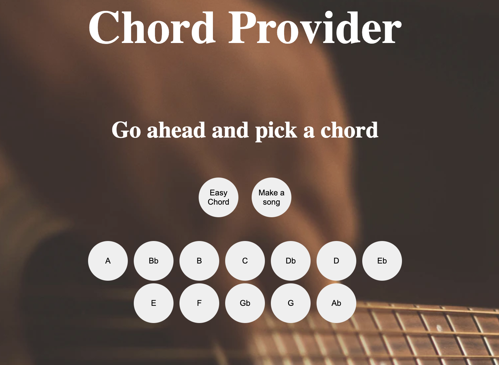
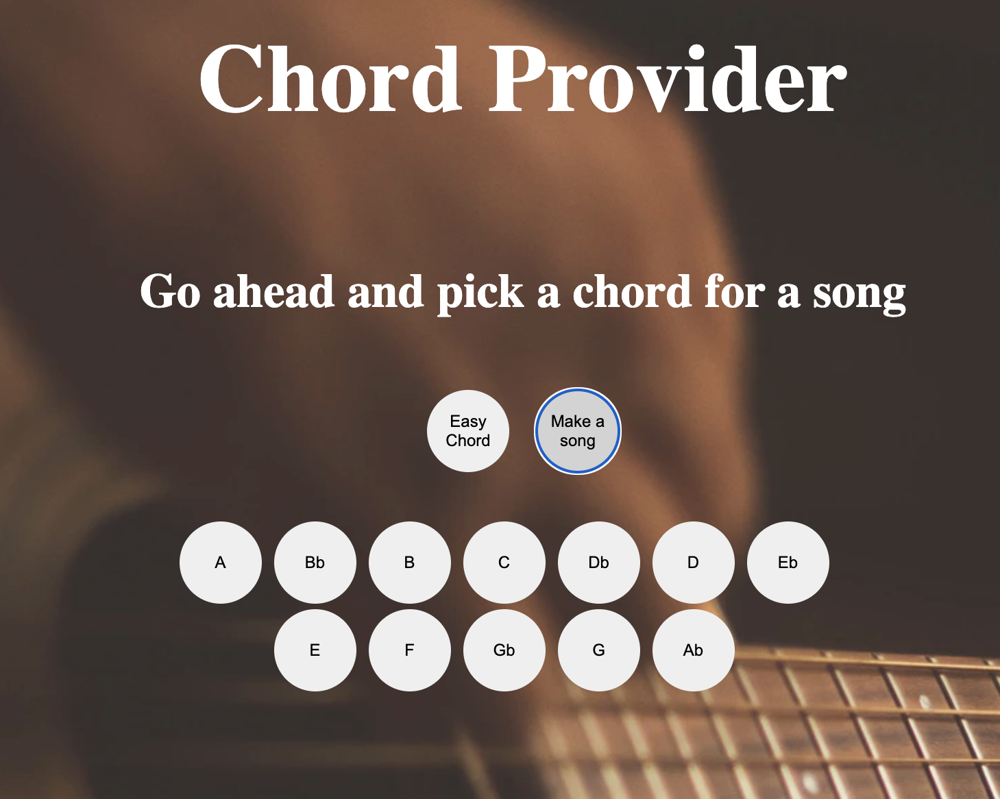
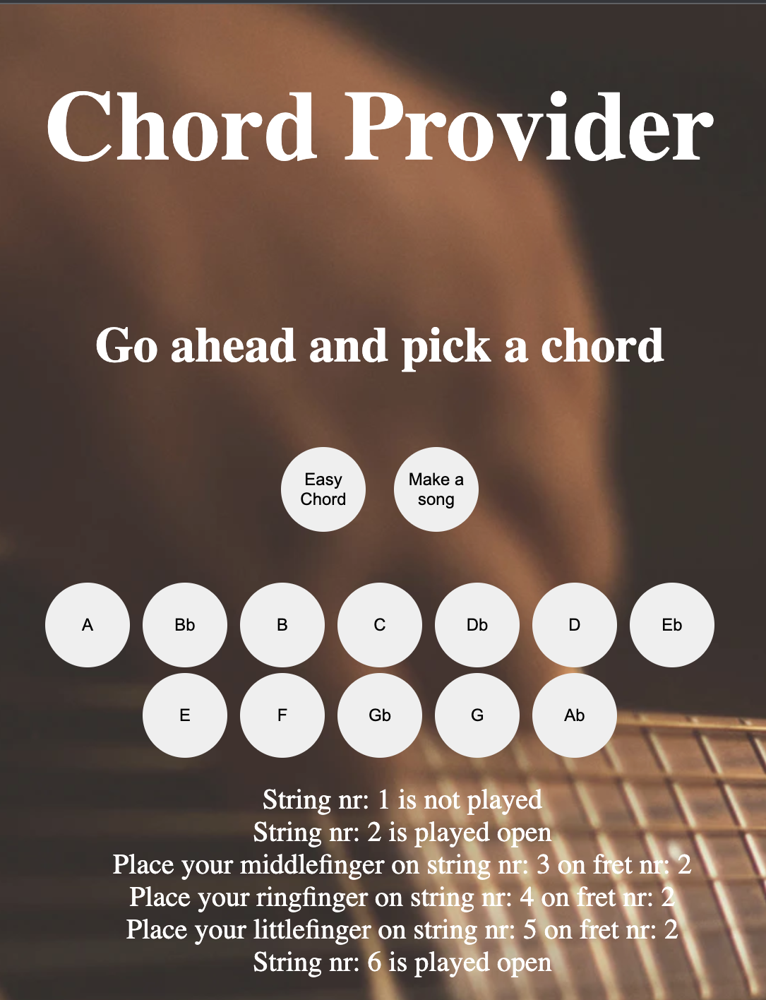
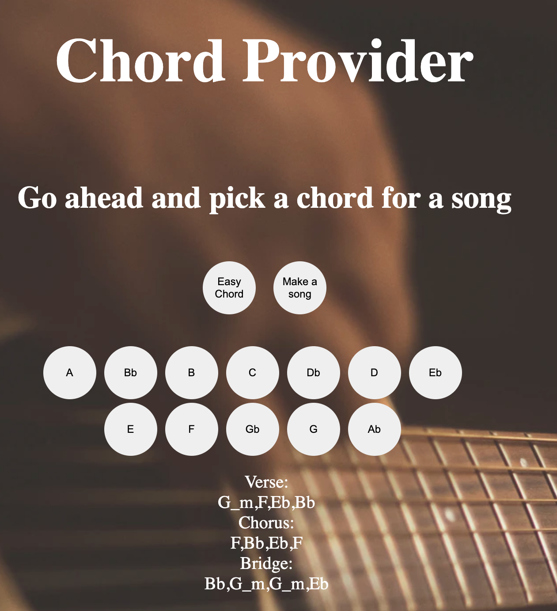
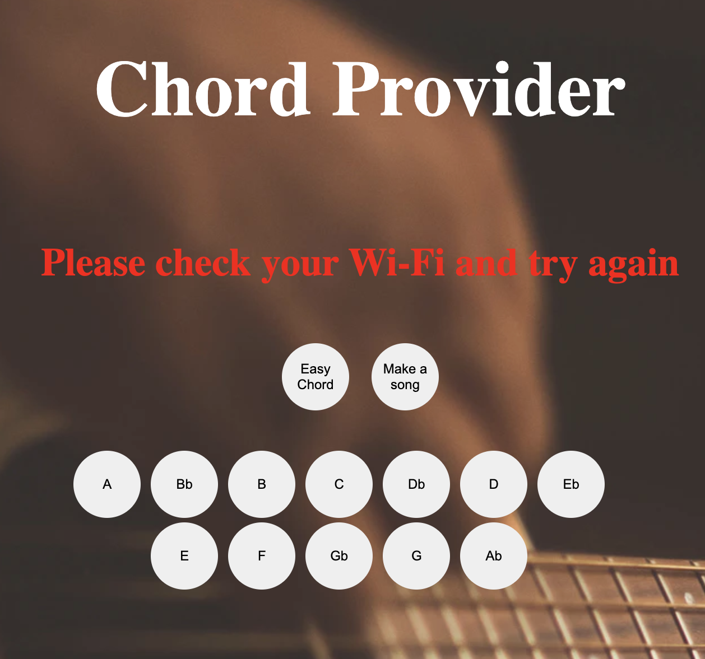

# Testning
För att testa applikationen så har jag använt mig av manuella enhetstester i form av Use cases.

## Testrapport

### Testrapport

| User cases| Testmetod | Status|       
| --------- |:---------:|:-----:|
| UC 1      | Manuellt test   |✅ |
| UC 2.1    | Manuellt test   |✅ |
| UC 2.2    | Manuellt test   |✅ |
| UC 3      | Manuellt test   |✅ |
| UC 4      | Manuellt test   |✅ |
| UC 5      | Manuellt test   |✅ |

## Förberedelser
* Installera applikationen enligt instruktionerna i README.md

---

## Testfall

## UC1 Navigera till startsidan 

**Beskrivning:** Testet utförs i syfte att kontrollera om användaren kommer till applikationens startsida.

**Instruktioner**
1. Starta genom att skriva följande kommando i terminalen `npm run dev`.
2. Fälj den länk som presenteras till local host.

**Förväntat utfall:** 

 

---

## UC2.1 – Välj alternativet Easy Chord

**Beskrivning:** Testet utförs i syfte att kontrollera om användaren kan välja Easy Chord.

**Instruktioner**
1. Välj alternativet Easy Chord genom att trycka på knappen.

**Förväntat utfall:** 

 

---

## UC2.2 – Välj alternativet Make a song

**Beskrivning:** Testet utförs i syfte att kontrollera om användaren kan välja Make a song.

**Instruktioner**
1. Välj alternativet Make a song genom att trycka på knappen.

**Förväntat utfall:** 

 

---

## UC3 – Välj ackordet A att presentera som Easy Chord

**Beskrivning:** Kontrollerar att applikationen visar ett ackord presenterat som instruktioner i text.

**Testinstruktion**
1. Välj alternativet Easy Chord genom att trycka på knappen.
2. Tryck på knappen A

**Förväntat utfall:** 

 

---

## UC4 – Välj ackordet Bb att presentera som Make a song

**Beskrivning:** Kontrollerar att applikationen visar en sångstruktur baserad på ackordet Bb.

**Testinstruktion**
1. Välj alternativet Make a song genom att trycka på knappen.
2. Tryck på knappen Bb

**Förväntat utfall:** 
Eftersom denna metod returnerar en slumpvis utvald ackordstruktur med ackord i rätt tonart så kommer olika ackord att finnas i strukturen.
Bilden visar ett exempel på detta.
Tester för att se att rätt ackord väljs ut finns i de automatiska testerna i Laboration-1

 

---
## UC5 – Flashmeddelande om användaren saknar uppkoppling eller om något gick fel när appen försökte hämta info från API.

**Beskrivning:** Kontrollerar att applikationen visar ett flashmeddelande om något gick fel gällande uppkoppling eller fetch.

**Testinstruktion**
1. Stäng av Wi-Fi.
2. Välj alternativet Make a song genom att trycka på knappen.
3. Tryck på knappen A

**Förväntat utfall:** 

 

---

